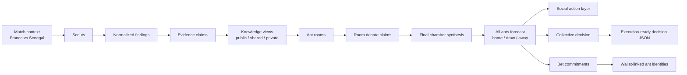
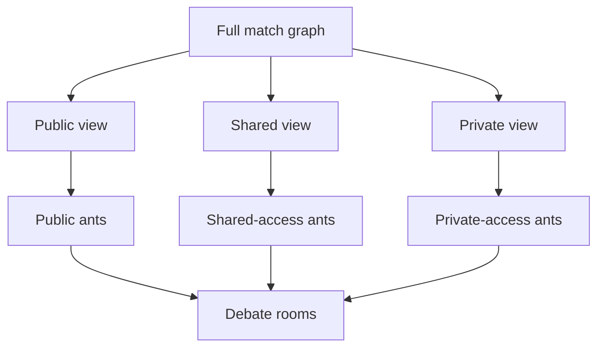
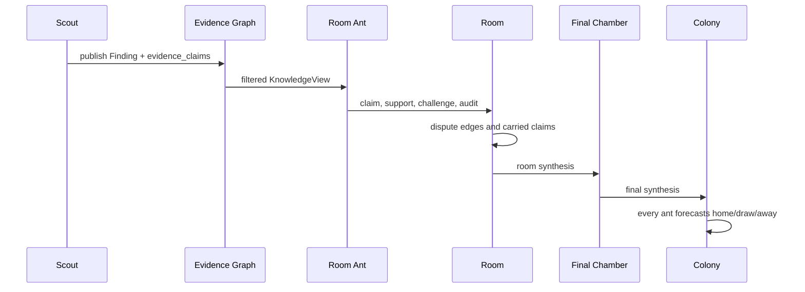
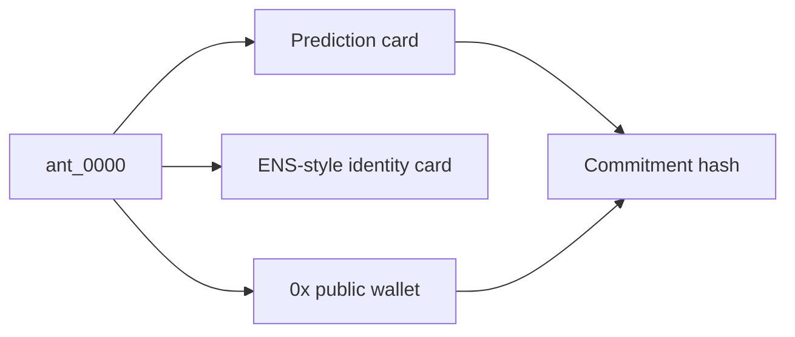

# Scout Interaction Schema

This document explains how Colony turns scout signals into ant decisions, social debate, and wallet-linked bet commitments.

## High-Level Flow

## Scout Layer

Scouts are data producers. They do not place bets and they do not debate directly. Their job is to create structured `Finding` objects that the rest of the system can audit and reuse.

Each finding carries:

- `scout_name`: the producer, for example `team_form_scout` or `odds_scout`
- `source_type`: market, stats, odds, news, lineup, weather, social
- `access_level`: `public`, `shared`, or `private`
- `summary`: short human-readable read
- `citations`: source handles or URLs
- `evidence_claims`: atomic claims used by debate rooms

The important design point is that ants do not browse freely during the debate. They receive filtered views of the scout graph.

## Knowledge Views

Each ant gets a different evidence view depending on its access tier and profile.

This lets the colony simulate information asymmetry:

- public ants only see cheap/open findings;
- shared ants can see stronger paid-like data;
- private ants can carry rarer signals into the debate indirectly.

## Room Interactions

Rooms are created around evidence themes such as market pricing, team form, lineup, weather, and social/news signals. A small set of representative ants speaks in each room, while the full population still receives the debate signal later.

A room claim includes the speaking ant, the stance, the evidence focus, and the access tier. This gives us traceability from a final decision back to the evidence that influenced it.

## Social Actions

After the room debate, Colony emits a MiroFish/OASIS-style social layer. It is not just decoration: it describes how ants react to one another and which claims propagate.

Current action families include:

- `post`: a room speaker publishes a claim
- `challenge`: another ant contests the claim
- `comment_support`: an ant reinforces a claim
- `comment_challenge`: an ant pushes back
- `quote_reply`: an ant reframes a claim with its own pick
- `like`: low-cost agreement
- `share`: propagation into the broader feed
- `follow`: attention edge between ants
- `prediction_card`: every ant publishes its final pick
- `synthesis`: final colony-level read

The structured action stream is written to `actions.jsonl` and `social_feed.json`.

## Wallet-Linked Ants

When a run uses `--agent-wallets`, each ant receives or reuses an EVM wallet from a local gitignored store. The private keys stay in `colony/secrets/agent-wallets.local.json`; public artifacts expose only public addresses.

Wallets give us a clean future bridge:

- the ant identity can be linked to an address;
- the forecast can create a commitment;
- the final colony decision can select one market side;
- a separate executor can turn selected commitments into real orders.

## Run Artifacts To Inspect

For a wallet-backed run, the most useful files are:

- `summary.md`: human summary
- `forecasts.csv`: every ant pick and stake
- `social_profiles.json`: persona, risk, activity, influence, wallet-linked identity context
- `social_feed.md`: readable interaction feed
- `social_feed.json`: structured social actions
- `actions.jsonl`: replayable action stream
- `decision.compact.json`: execution-friendly colony decision
- `scouting_audit.json`: scout coverage and missing evidence backlog
- `world_graph.json`: graph linking match, teams, scouts, claims, ants, and predictions

## Current Betting Boundary

The harness currently produces wallet-linked commitments and a structured colony decision. Actual Polymarket order placement remains intentionally separate in `polymarket/execute_colony_bets.py`, so simulation runs can stay safe by default.
