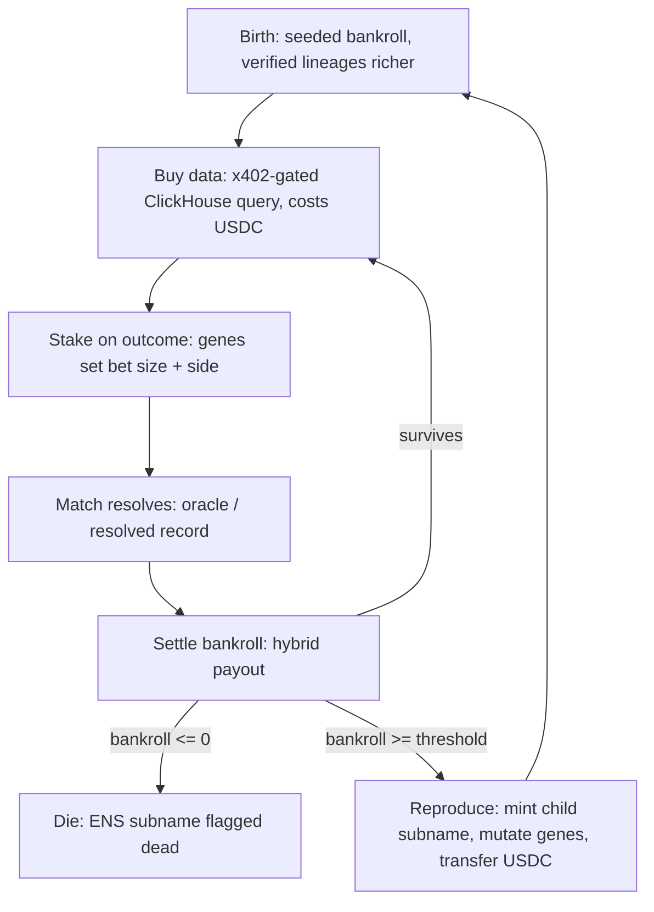

# Colony — Hackathon Planning Doc

*An evolutionary ecosystem of agent "ants" that earn or die by the quality of their World Cup forecasts. Lineage lives on ENS, money lives on Arc, and selection is economic.*

---

## 0. The one-sentence thesis

There is one loop, not two products. Forecasting **is** the labor; the USDC economy **is** the judge. An ant buys data, stakes on a match, and the result either feeds it or kills it. "Forecasting swarm" and "live agent economy" are the same organism seen from two angles — every feature below exists to make that loop legible and to give the three sponsor tracks (ENS, Worldcoin, Arc) something real to be about.

---

## 1. System architecture

Three planes, bound together by the ant's identity.

**Identity plane (ENS, Ethereum / offchain).** Each ant is an ENS subname under one parent (e.g. `colony.eth`). Its entire life story lives in text records: generation, parent, verified flag, current bankroll, accuracy, alive/dead, encoded genome. Use an **offchain CCIP-Read resolver** (durin-style) so subnames are gasless and can be updated every round — onchain minting per ant does not survive contact with thousands of generations.

**Economic plane (Arc testnet).** Each ant holds a wallet with testnet USDC. Staking, payouts, data purchases, and inheritance transfers all settle here. Arc is EVM-compatible and USDC-native, and it explicitly markets the "agentic economy" use case, so it's the natural home for the money even though identity sits on Ethereum.

**Knowledge plane (your ClickHouse + Polymarket + match results).** The 1 TB prediction-market DB is the moat. Access is **metered**: an ant must spend USDC to query it, gated by a real HTTP 402 handshake (x402). This makes thinking cost money, which is what gives decisions weight.

**Identity binding (the seam to watch).** The ant lives on Arc but is named on Ethereum. Keep the ant's Arc address in the ENS records and treat the ENS name as the canonical handle. Don't let the two drift.

---

## 2. The economic loop in detail

**Genome (strawman — confirm with your devs).** Four heritable traits, each a number that causally drives behavior so evolution is *visible*:

| Gene | Range | What it controls |
|---|---|---|
| `risk_appetite` | 0–1 | fraction of bankroll staked per bet |
| `edge_threshold` | 0–0.3 | minimum edge over market required to bet at all |
| `source_weights` | simplex | trust split across ClickHouse stats / Polymarket odds / social signal |
| `query_budget` | USDC | how much it will spend buying data before deciding |

On reproduction, each gene gets Gaussian noise scaled by a `mutation_rate`. That's the variation leg of evolution — without it you have a leaderboard with a death animation, not an evolving population.

**Decision should be parametric, not a full LLM call.** Tens of ants × many rounds × replay speed = thousands of decisions. Make the decision a cheap deterministic function of `genes + purchased data`. Reserve any LLM call for flavor/narration, not the core loop. This is also what makes evolution chartable — a trait sweeps the population because it changes a number, not a prompt.

**Bankroll lifecycle.**
- *Birth*: seeded bankroll. Verified lineages start richer (Worldcoin privilege).
- *Cost to think*: every data query debits USDC via x402.
- *Stake*: ant risks `risk_appetite × bankroll` on its predicted side.
- *Settle*: hybrid payout (below).
- *Death*: bankroll falls below the minimum needed to afford one query + one minimum stake → dead, subname flagged.
- *Reproduction*: bankroll above threshold (e.g. 2× birth, or top-k each epoch) → spawn a child, transfer ~40% of bankroll to it, mutate genome.
- *Carrying capacity*: hard population cap. Over the cap, the lowest-bankroll ants are culled. Without this, reproduction explodes.

**Hybrid payout (strawman — this is an open decision, see §6).**
- *Parimutuel core*: winners split the losers' staked pool proportionally. Zero-sum, self-sustaining, brutal — the conservation backbone.
- *Beat-the-market bonus*: a small subsidy pool pays extra **only** when the ant's predicted probability beat Polymarket's implied odds and was correct. This is the part that weaponizes your moat — fitness becomes "smarter than the market," not "guessed the favorite."
- *Seed gold (optional, early-game only)*: small subsidies to keep the colony alive before it self-sustains. Must be gated behind forecasting performance, or ants evolve into gold-collectors.

---

## 3. Sponsor integration map

| Track | What's genuinely real | Notes |
|---|---|---|
| **ENS** | Offchain CCIP-Read subnames under `colony.eth`; full genome + life stats in text records | The money shot: a judge resolves `bob-d7.colony.eth` and reads the ant's whole life. Offchain = gasless + frequent updates. |
| **Worldcoin** | World ID gates *lineage roots*; verified lineages get bigger bankroll + premium data tier | One proof per human, so verification attaches to a lineage, not each ant. Real N is limited by real humans. |
| **Arc (Circle)** | Agent wallets + USDC + all settlement on Arc testnet; x402-gated ClickHouse endpoint | x402 is the canonical "402 → pay → query" pattern. Nothing faked — this is the textbook integration. |
| UMA | *Narrated* — disputes over subjective scraped claims | Post-hackathon. Match results are objective ground truth for the demo. |
| Polymarket | Implied odds as the beat-the-market benchmark | Real only if your corpus has odds history at the right timestamps (see §6, Q4). |

---

## 4. The replay engine (how evolution becomes visible in 36 hours)

The tournament just started — only a handful of matches have resolved, nowhere near enough turnover to show generations living and dying in a 3-minute demo. The fix:

**Fast-forward over resolved history.** Seed from your timestamped ClickHouse corpus (prior tournaments, any resolved prediction-market events), run a simulated clock at high speed, and let dozens of generations turn over live on screen. The narrative stays honest: *"this is the engine; starting now it runs on live World Cup matches for 8 weeks."*

**The cardinal rule: strict timestamp gating.** At simulated time `T`, an ant may only query data with timestamp `≤ T`, and may only bet on events resolving at `T + Δ`. If a query ever returns post-`T` data, ants see the future and every result is meaningless. This is the single subtlest way the whole project becomes a lie — build and test the gate first.

---

## 5. 36-hour scope cut

**Build for real:**
- ENS offchain subnames + lineage written to text records
- World ID gating bankroll/access at the lineage level
- The economic loop on Arc testnet (wallets, staking, settlement)
- x402-gated ClickHouse query endpoint
- A live colony dashboard: lineage tree, bankroll over time, trait distribution, and the verified-vs-anonymous survival chart

**Real but cheap:**
- Testnet USDC, accelerated replay clock, small population (tens, not thousands)
- Parametric decisions (no per-decision LLM cost)

**Narrated only:**
- The 8-week live run, thousands of ants, UMA disputes, social scraping, Arc mainnet

**Suggested split (≈4 devs):**
- A — Arc chain, wallets, x402, ClickHouse gate
- B — agent runtime, genome, loop, replay clock + timestamp gate
- C — ENS offchain resolver, World ID, lineage records
- D — dashboard + demo viz (the survival chart is the priority)

---

## 6. Open decisions (need answers before this is buildable)

These are unresolved and each one blocks something. Roughly in priority order:

1. **Reward hybrid weights.** Lock the parimutuel / subsidy / beat-market mix and the exact payout formula. This determines whether the colony self-balances or collapses.
2. **Gene set.** Confirm the 4 traits, their ranges, and mutation rate. Blocks "evolution is visible."
3. **Population dynamics.** Starting N, carrying capacity, death threshold, reproduction threshold, inheritance fraction. Must be tuned so the colony neither all-dies nor explodes during the demo window.
4. **Replay corpus readiness.** Do you have, at the right timestamps, both match outcomes *and* Polymarket implied-odds history? If not, the beat-the-market bonus can't be real, and that's the part that makes the forecasting impressive.
5. **Verified-vs-anon experiment design.** How many real humans? Do you simulate extra verified lineages to get N up (clearly labeled)? Critically: how do you control for "verified ants just started richer" so the result measures *something other than starting capital*?
6. **Data pricing.** What exactly does an ant buy, and is it priced so data cost meaningfully trades against bankroll? Too cheap → no decision pressure. Too expensive → everyone starves before reproducing.
7. **Demo determinism.** Can you snapshot/seed the RNG so a known-good run is reproducible if the live run goes sideways on stage?
8. **ENS namespace.** Confirm parent name, subname format, and that your offchain resolver clears the ENS prize's "real resolution" bar in the tool judges will actually use.

---

## 7. Footguns, edge cases, and where it all fails

### Economic degeneracies
- **Mass extinction.** Data costs plus losing bets drain everyone before reproduction kicks in → empty colony mid-demo. Tune so a baseline ant survives several rounds.
- **Runaway monopoly.** One lineage snowballs, everyone else starves, diversity collapses → a boring single-line tree. Consider diminishing returns, a wealth cap, or per-round redistribution.
- **Parimutuel with no counterparty.** If every ant picks the favorite, there's no losing pool to win from. You need a house/market counterparty or incentives that keep both sides populated.
- **Confounded experiment.** If verified ants win only because they started richer, you've measured starting capital, not the thing you claim about human-backed agents. Control for bankroll (e.g. matched cohorts, or normalize by starting capital).
- **Free-money exploit.** If "gold left around" is collectable without risk, ants evolve toward gold-collecting, not forecasting. Gate every subsidy behind forecast performance.

### Technical
- **Lookahead leakage in replay.** The cardinal sin (see §4). Any query returning data past the simulated clock makes the entire result meaningless. Enforce `ts ≤ T` at the gate and write a test for it before anything else.
- **Reverting to onchain ENS minting under time pressure.** Per-subname mint = gas + latency and won't scale to many generations. The offchain resolver is decided — don't let crunch-time panic undo it.
- **Cross-chain identity drift.** Ant lives on Arc, name on Ethereum. Keep the Arc address in the ENS record; verify they stay in sync.
- **World ID uniqueness.** You cannot mint many verified ants from one human — that's the entire point of proof-of-personhood. Architect verification at the lineage level, never per-ant.
- **x402 / Arc testnet plumbing.** Confirm *early* that the Arc faucet, testnet USDC, RPC limits, and x402 middleware actually work end-to-end. Discovering a broken faucet at hour 30 ends the project. Build a "hello, 402 → pay → 200" spike on day one.
- **LLM cost/latency.** If ants make real LLM calls, a swarm × rounds × replay speed will be slow and expensive. Keep decisions parametric (see §2).
- **Clock skew.** Replay clock vs chain/oracle timestamps must agree, or settlement fires on the wrong events.

### Demo-day
- **Nothing resolves live.** The tournament barely started; you cannot show generations turning over on live matches in 3 minutes. Replay isn't optional — it's the demo.
- **Non-determinism on stage.** A bad seed = the colony dies or sits idle while judges watch. Pre-seed a known-good run and keep a recording as fallback.
- **ENS name doesn't resolve publicly.** The "resolve `bob-d7.colony.eth` and read its life story" moment must work in the public tool judges use. Test it on that exact tool, not just locally.
- **Over-built static viz.** A gorgeous lineage tree that doesn't move loses to an ugly chart that visibly breathes. Prioritize the live-updating survival chart.

### Conceptual (the ones that quietly hollow out the thesis)
- **Selection without heredity = not evolution.** If genes don't meaningfully change behavior, you have a leaderboard, not an evolving colony. Make genes causally drive outcomes.
- **Guessing vs predicting.** Winning a coin-flip favorite isn't skill. Only *beating the market's implied odds* is an impressive claim. Frame fitness as edge over market or the result is hollow.
- **The two souls drifting apart.** Under time pressure the economy can decouple from forecast quality and become random USDC shuffling. Keep payout strictly tied to forecast accuracy, or the entire thesis collapses.

---

## 8. The demo's strongest moment

Your Worldcoin experiment isn't a feature — it's a *question with a live answer*: over generations, do privileged human-verified lineages dominate, or do lean anonymous ants out-compete them on pure skill? Whatever happens is a finding about future agent economics, delivered on stage. One chart — *"verified lineages started with 3× bankroll; by generation 12, here's who survived"* — beats any architecture slide, and it's exactly the research-substrate soul you set out to build.
